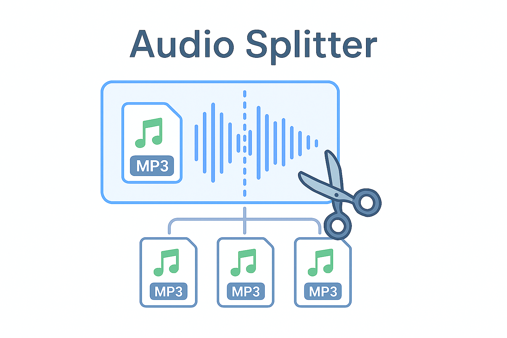

<p align='center'></p>

# Audio Splitter

A minimal, elegant audio splicing tool for audio files. Load any audio file, place markers at split points, and download lossless audio segments with a single click.

## Features

✨ **Core Functionality**

- 🎵 Support for all audio formats (MP3, WAV, OGG, FLAC, AAC, M4A, and more)
- 📊 Visual waveform with click-to-place markers
- ✏️ Editable marker timestamps for precise control (down to milliseconds)
- 🎵 Real-time preview of audio segments
- ✂️ Lossless audio splitting using FFmpeg
- 📦 Auto-packaged segments in ZIP format
- 🎨 Modern, professional UI with smooth interactions
- ☁️ Deploy anywhere - works on Cloudflare Pages, GitHub Pages, or any static host

## Why?

I built this tool to solve a specific need for my another project [Murajah](https://github.com/wasi0013/murajah/). I use this primarily for splitting long Qur'anic recitations of full Juz' and Surahs into clean, verse‑by‑verse segments. I wanted a workflow that was precise, and lossless. Since, Murajah focuses on structured memorization and review, it is important to make the split accurate.

  >**Project link**: <https://github.com/wasi0013/murajah>

Initially tried with AI models, however the output was clumsy, and sometime with awkward marker placement due to reciter's repition or subtle recitation styles.  
This project aims to keep things simple: load an audio file, place markers, fine‑tune timestamps down to milliseconds, preview segments, and export without re‑encoding. It preserves the original audio quality from your favorite reciters or speakers.

## Installation

### Prerequisites

- Node.js 18+

### Setup

1. Install dependencies:

```bash
npm install
```

This installs dependencies for the frontend via npm workspaces. The backend is no longer required!

### Running

```bash
cd frontend
npm run dev
```

Frontend runs on `http://localhost:5173`

**That's it!** Audio processing happens entirely in your browser using FFmpeg.wasm. No backend server needed.

### Build for Production

```bash
cd frontend && npm run build
```

This creates an optimized static build ready for deployment on **Cloudflare Pages** or any static hosting provider.

---

## How to Use (Step-by-Step)

### Step 1: Load Your Audio

1. Click the **"🎵 Load Audio"** button to upload an audio file
2. Supported formats: MP3, WAV, OGG, FLAC, AAC, M4A, and more
3. The waveform will display once the file loads
4. Audio player controls appear below the waveform

### Step 2: Place Markers

You have two ways to add markers:

#### Method A: Click on the Waveform

- Click anywhere on the waveform to place a marker at that position

## Installation

### Prerequisites

- Node.js 18+

### Setup

1. Install dependencies:

```bash
npm install
```

This installs dependencies for the frontend via npm workspaces. The backend is no longer required!

### Running

```bash
cd frontend
npm run dev
```

Frontend runs on `http://localhost:5173`

**That's it!** Audio processing happens entirely in your browser using FFmpeg.wasm. No backend server needed.

### Build for Production

```bash
cd frontend && npm run build
```

This creates an optimized static build ready for deployment on **Cloudflare Pages** or any static hosting provider.

---

## How to Use (Step-by-Step)

### Step 1: Load Your Audio

1. Click the **"📁 Single File"** button to upload a single MP3 file
2. **OR** click **"📂 Bulk Folder"** to bulk upload multiple MP3s from a folder
3. The waveform will display once the file loads
4. Audio player controls appear below the waveform

### Step 2: Place Markers

You have two ways to add markers:

#### Method A: Click on the Waveform

- Click anywhere on the waveform to place a marker at that position
- Markers appear as numbered points on the timeline.
- I usually mark the places where the wave has drop of energy. This placement are almost accurate for most cases. 
- If the placements are slightly off, I modify the markers using the marker fields.

#### Method B: Use the Add Marker Button

- Play the audio, listen attentively.
- Press the **"+ Add Marker"** button to mark the desired playback position realtime.
- Useful while listening to recitation to mark points in real-time with minimal effort.

### Step 3: Fine-Tune Marker Positions

1. Look at the **"Markers"** section below the waveform
2. Each marker shows a number and an **editable timestamp field**
3. Click on the numbers of the timestamp to select the numbers and then replace it
4. Accepted formats:
   - `H:MM:SS.ms` (e.g., `0:01:23.456`) - Full precision with milliseconds
   - to replace `23` select and highlight `23` then type your preferred value.
5. The audio automatically seeks to the new position
6. Markers auto-sort by time
7. Click **"Remove"** to delete a marker

### Step 4: Preview Segments

1. The **"Segments"** section shows how your audio will be split:
   - **Segment 1**: From start (0:00) to first marker
   - **Segment 2+**: Between consecutive markers
   - **Last Segment**: From last marker to end
2. Hover over any segment to see its time range
3. Click on a segment number to preview it (audio plays just that portion)
4. The preview status shows: `Playing: Segment X (start → end)`

### Step 5: Split the Audio

1. Click the **"Split (X)"** button (shows the number of segments that will be created)
2. Processing starts - button shows "Processing..." state
3. Once complete, a ZIP file automatically downloads containing:
   - Numbered audio files: `originalfilename000.mp3`, `originalfilename001.mp3`, etc.
   - Folder structure matching your input (for bulk uploads)
   - Lossless quality preserved (codec copy, no re-encoding)

### Step 6: Download & Use

- All segments are automatically downloaded as `audio-segments.zip`
- Extract the ZIP to access individual MP3 files
- Each segment file is named: `[originalname][3-digit-number].mp3`
  - Example: `podcast000.mp3`, `podcast001.mp3`, `podcast002.mp3`
- Each segment is lossless (no quality loss from the original)
- Files are numbered sequentially starting from 000

---

## Efficient Tips & Tricks

### For Precise Timing

- Use the editable timestamp fields for frame-accurate control
- Copy-paste timestamps if you need to match multiple markers
- Use preview to verify segment boundaries before splitting

### For Bulk Operations

- Upload entire folders to process multiple files at once
- Select which file to edit using the dropdown
- All settings reset when you switch files

### For Large Files

- The waveform may take a moment to render for large audio files
- Marker placement is instant once waveform loads
- Processing time depends on file size (large files take longer)

### Keyboard Shortcuts

- Use Tab to move between marker timestamp fields
- Click outside the input or press Enter to confirm changes

---

## Tech Stack

### Frontend

- React 18
- Vite 5 (lightning-fast dev server and build)
- WaveSurfer.js 7.7 (waveform visualization)
- **FFmpeg.wasm 0.12.10** (browser-based audio processing)
- jszip 3.10 (in-browser ZIP file creation)
- Modern CSS with gradients and smooth animations

### Why FFmpeg.wasm?

This project now runs **entirely in the browser** with no backend server:

✅ **Advantages:**
- **True serverless** - Deploy on Cloudflare Pages, GitHub Pages, or any static host
- **Zero infrastructure** - No servers to maintain or pay for
- **User privacy** - Audio files never leave your device
- **Offline capable** - Works without internet after initial load
- **Lossless audio** - Same `-c copy` codec copying as before
- **Fast deployment** - Single static artifact to deploy

⚠️ **Processing Notes:**
- Audio processing happens on your machine (~1-2x slower than native FFmpeg)
- Initial load downloads FFmpeg.wasm (~30-50MB, cached by browser)
- Practical file size limit: ~2GB (browser dependent)
- Processing time: ~30-60 seconds for typical 20-30MB Quranic recitations

### Architecture

- Single-page React application
- FFmpeg.wasm handles all audio processing in the browser
- Browser's native File APIs for input/output
- No backend API required
- Deployable to any static host

---

## Project Structure

```bash
audio-splitter/
├── frontend/                 # React app (Vite)
│   ├── src/
│   │   ├── App.jsx          # Main component
│   │   ├── App.css          # Modern styling
│   │   ├── Waveform.jsx     # WaveSurfer wrapper
│   │   ├── main.jsx         # Entry point
│   │   └── lib/
│   │       ├── ffmpegProcessor.js  # FFmpeg.wasm wrapper
│   │       └── zipUtils.js         # ZIP creation utilities
│   └── package.json
├── package.json             # Workspace config
└── README.md

📌 Note: Backend folder removed - all processing happens in the browser!
```

---

## 🚀 Deployment to Cloudflare Pages

Since this is now a **static frontend-only application**, deployment is incredibly simple!

### Step 1: Build the Project

```bash
cd frontend && npm run build
```

This creates a `dist/` folder with the optimized static site.

### Step 2: Deploy to Cloudflare Pages

#### Option A: Using Wrangler CLI

```bash
# Install Wrangler if you haven't already
npm install -g wrangler

# Deploy from the frontend directory
cd frontend
wrangler pages deploy dist
```

#### Option B: Using GitHub Integration

1. Push your code to GitHub
2. Go to [Cloudflare Dashboard](https://dash.cloudflare.com/)
3. Navigate to **Pages** → **Create a project** → **Connect to Git**
4. Select your `audio-splitter` repository
5. Set build command: `cd frontend && npm run build`
6. Set build output directory: `frontend/dist`
7. Click **Deploy**

#### Option C: Using Git with Auto-Deploy

```bash
# Once connected to Cloudflare Pages via Git, just push to deploy
git add .
git commit -m "Deploy to Cloudflare Pages"
git push origin main
```

### Your App Will Be Live At:

- `https://your-project-name.pages.dev`

### Why Cloudflare Pages is Perfect for This:

✅ **Completely Free**  
✅ **Global CDN** - Fast access worldwide  
✅ **Unlimited deployments** - Deploy every commit  
✅ **Zero configuration** - Just point and deploy  
✅ **HTTPS included** - Automatic SSL certificates  

---

## Troubleshooting

### FFmpeg.wasm takes a while to load

- This is normal! The first load downloads ~30-50MB of WebAssembly code
- Subsequent uses are instant (it's cached in your browser)
- You'll see a loading indicator in the header

### Audio processing is slower than before

- FFmpeg.wasm runs in JavaScript/WebAssembly, which is slower than native FFmpeg
- However, for lossless splitting (codec copy), typical files still process in 30-60 seconds
- This is the tradeoff for having **zero infrastructure costs** and **true serverless deployment**

### "FFmpeg not initialized" error

- Wait for the FFmpeg loading indicator to show "Ready" before processing
- Hard refresh the page (Cmd+Shift+R on Mac) to clear cache if stuck
- Check browser console for any network errors preventing WASM download

### No waveform appears after upload

- Ensure file is a valid MP3
- Check browser console for errors
- Try a different MP3 file
- Some corrupted MP3s may not load properly

### Markers not updating

- Ensure timestamp format is correct: `H:MM:SS.ms` or `MM:SS.ms`
- Clear browser cache and reload if stuck

### Split fails or times out

- Try with a smaller file first
- Check browser console for specific error messages
- If processing takes >2 minutes, the browser may timeout
- Refresh and try again with a smaller file

### Download doesn't start

- Check browser download settings
- Try a different browser if stuck
- Check browser console for errors

### Browser crashes or runs out of memory

- This app uses browser RAM for audio processing
- Practical limit is around 2GB depending on your device
- Try with smaller files if you experience crashes

### WASM file download fails (deployment)

- Ensure Cloudflare Pages is serving `.wasm` files with correct MIME types
- This usually works automatically, but if issues persist, check Cloudflare's static file cache rules
- Verify that the build includes the WASM files in the `dist/` folder

---

## License

[GNU General Public License v3.0](/LICENSE)

